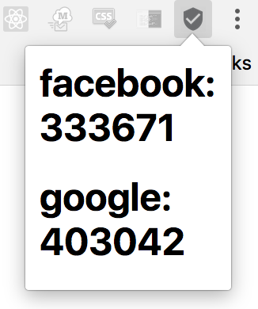

# Chrome-Auth
2Factor Authentication Chrome Extension

## Installation
1. Clone repo
2. Create `auths.js` file
3. Create `auths` object of key value pairs where key = platform and value = secret
```javascript
const auths = {
	'facebook': 'TESTING12345TEST',
	'google': 'TESTING54321TEST'
};
```
4. Add your own secrets to `auths`
5. Load the extension using [these steps](https://developer.chrome.com/extensions/getstarted#unpacked).
6. Enjoy


